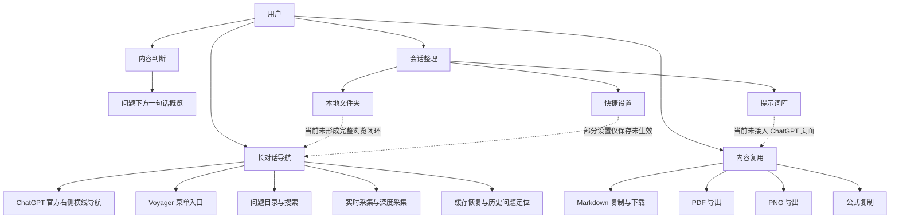
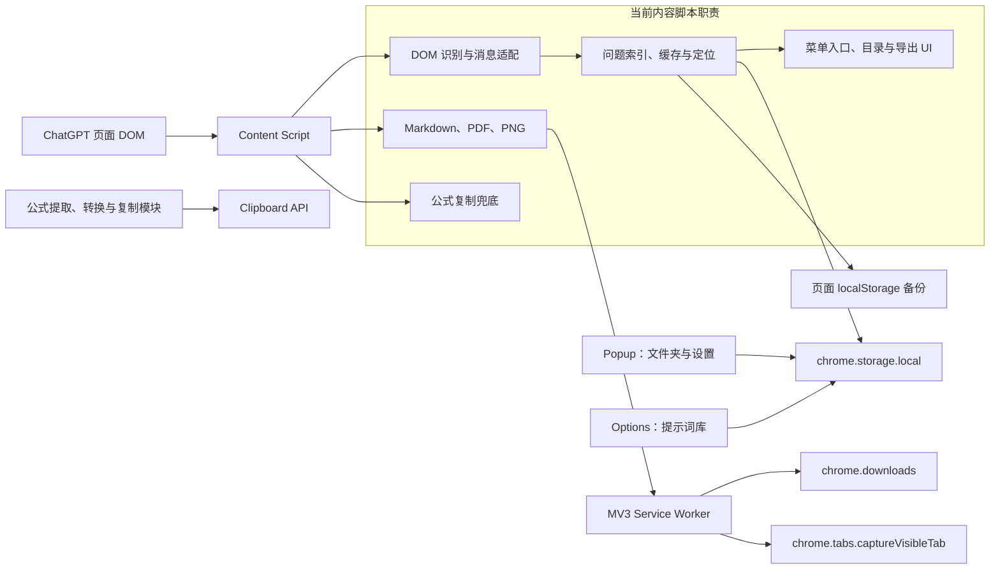

# Voyager MVP Specification

## 文档状态

- 基准日期：2026-06-15
- 基准来源：当前本地工作区，而不是仅以 `origin/main` 或已发布版本为准
- 状态：规划基线；不代表当前工作区已经通过真实 Chrome 验收

## 产品判断

Voyager 是一个面向 ChatGPT 长对话的本地浏览器扩展。核心价值不是增加新的聊天能力，而是帮助用户：

1. 在长对话中快速找到并重新定位用户问题。
2. 在跳转前通过问题文本和一句话概览判断目标内容。
3. 将当前页面已经加载的对话内容可靠地导出和复用。

当前工作区已经包含较多增强能力，但核心导航仍缺少真实 Chrome 行为验证，因此 MVP 的第一目标是建立稳定、可验证的长对话导航闭环。

## 功能架构

## 技术架构

当前实现采用 Manifest V3、原生 JavaScript 和本地存储，没有运行时第三方依赖，也没有外部 AI API。核心导航、缓存、定位和主要页面 UI 集中在 `src/content/content.js`。

## MVP 目标

MVP 必须证明以下闭环在真实 ChatGPT 页面中可靠可用：

1. Voyager 能识别当前对话中的用户问题，且不会把助手回复、输入框或 Voyager 自身 UI 识别为问题。
2. 用户可以通过 ChatGPT 官方右侧横线导航跳转，并通过 Voyager 菜单打开目录、导出等插件功能。
3. 长对话、虚拟化 DOM、历史消息加载和页面刷新后，已记录问题仍可恢复或明确显示为需要重新采集。
4. Voyager 目录展示已记录问题；目录弱锚点问题必须通过验证式定位尝试跳转，失败时明确提示。
5. 回答辅助信息必须明确标记为“一句话概览”，不能冒充外部 AI 语义总结。
6. 用户可以选择当前已加载消息并复制或下载 Markdown。
7. 所有数据默认保存在本地，不向外部服务发送对话内容。

## MVP 范围

| 能力 | MVP 要求 |
| --- | --- |
| 用户问题识别 | 支持 ChatGPT 当前常见 turn 和直接 user-role DOM 结构；去重并排除误识别 |
| 官方导航集成 | 不渲染第二套插件横线；保留官方导航中部附近的 Voyager 菜单入口 |
| 问题目录 | 展示全部已记录问题、搜索、状态提示、点击定位 |
| 一句话概览 | 对当前已加载的后续助手回复生成本地提取式概览；命名准确 |
| 实时采集 | 浏览和滚动时持续更新问题索引 |
| 深度采集 | 用户主动触发后遍历长对话，支持取消并恢复原滚动位置 |
| 缓存恢复 | 按会话隔离缓存；刷新和路由切换时不串话 |
| Markdown 导出 | 选择消息、复制 Markdown、下载 Markdown |
| 隐私 | 不增加外部 API，不上传对话内容 |

## 非目标

以下能力不是 MVP 完成的阻塞条件：

- 真正的 AI 语义总结、主题聚类或向量搜索。
- 跨会话全文搜索、云同步、团队共享和知识库集成。
- Claude、Gemini、`chat.openai.com` 等其他站点适配。
- 完整 LaTeX 解析器或所有 Word/WPS 版本的公式兼容。
- PDF、PNG、公式复制的全部边界兼容性。
- 文件夹中的完整会话浏览、提示词一键插入和所有快捷设置生效。
- 在完成行为基线前重构或拆分 `content.js`。

## 硬性约束

1. 不得丢失或覆盖当前工作区已有改动；禁止使用可能清除本地改动的 Git 操作。
2. 修改任何产品代码前必须遵守 `AGENTS.md` 和 `REGRESSION_LOG.md`。
3. 目录完整性修复不得破坏已记录问题顺序、重复问题身份和失败提示。
4. 插件不得渲染第二套右侧问题横线，也不得阻塞 ChatGPT 官方横线导航的点击和滚动。
5. 一句话概览不得命名为摘要或总结，除非未来引入并验证真实语义总结能力。
6. 未加载到 DOM 的消息不能被描述为已经导出或已经生成一句话概览。
7. 缓存必须按会话隔离；新建未保存会话转为持久会话时不得污染其他会话。
8. 默认保持本地处理，不新增网络请求或权限，除非经过单独决策和隐私审查。
9. 自动检查通过不能替代真实 Chrome 手工验收。

## MVP 完成标准

只有同时满足以下条件，才能把 MVP 标记为完成：

- `npm run check` 在目标提交或工作区上通过。
- `npm run build` 在目标提交或工作区上通过，并确认生成的 `dist/` 可加载。
- `docs/MANUAL_TEST_CHECKLIST.md` 中所有 P0 用例在真实 Chrome 的 `https://chatgpt.com/*` 页面通过。
- 至少验证一个短对话、一个长对话、一个新建未保存对话和一个保存后重新加载的对话。
- 官方导航共存、目录完整性、缓存隔离、问题定位和一句话概览历史回归均有验证证据。
- Markdown 复制和下载在当前已加载消息上通过。
- 所有发现的问题已记录到 `REGRESSION_LOG.md`；未解决问题明确记录为阻塞项或后续计划。
- `docs/GOAL_STATUS.md` 更新为实际验证结果，不包含未经验证的完成声明。

## 当前完成度判断

截至 2026-06-15，当前工作区已经包含上述多数 MVP 实现，并通过现有语法和静态回归检查；但尚未执行完整真实 Chrome 验收，也未用当前工作区重新验证构建产物。因此 MVP 状态应记录为“实现候选，等待行为基线验证”，不能记录为完成。
